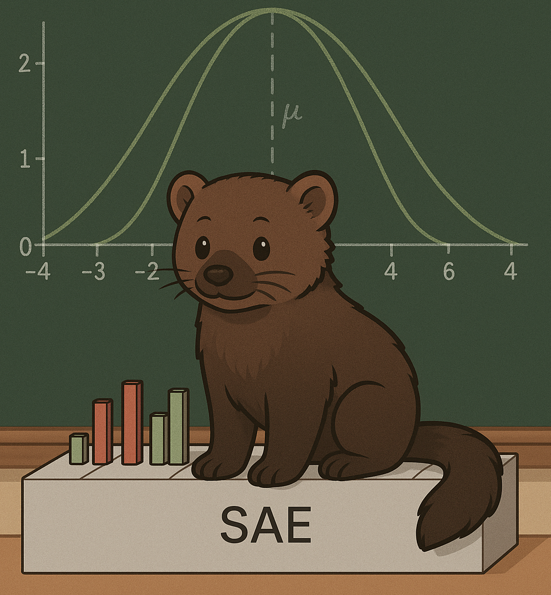

# Fisher Information-Guided Sparsity in Autoencoders

**Author**: Rui Melo  
**Conference**: Preliminary results (Withdrawn)



**Note**: I've decided to not continue with this project due to change of research focus and the results not being clearly superior to existing methods. The Fisher SAEs showed promise in improving sparsity and feature decorrelation, but the reconstruction fidelity and uncertain interpretability benefits did not justify further development at this time.
The repository remains available for educational purposes and further research. If you have any questions or would like to collaborate or further expand the idea, feel free to reach out.

## Overview

This repository implements **Fisher SAEs** — a new class of Sparse Autoencoders (SAEs) enhanced with a Fisher Information-based regularization term. Fisher SAEs aim to improve feature sparsity, disentanglement, and interpretability in large language models (LLMs), especially in tasks such as circuit discovery, representation learning, and code analysis.

Key benefits:
- Reduced feature co-activation
- Improved sparsity (ℓ0, ℓ1)
- Minimal compromise on reconstruction fidelity
- Better feature decorrelation and interpretability

## Key Idea

Traditional SAEs can suffer from **feature redundancy** and **co-activation**. Fisher SAEs address this by adding a new loss term derived from the **empirical Fisher Information Matrix**, penalizing correlated feature gradients.

**Loss Function**:
```

L\_total = L\_reconstruction + λ \* L\_sparsity + θ \* L\_fisher

```

## Components

- **Sparse Autoencoder variants**: Standard, JumpReLU, and Gated architectures
- **Activation types**: Residual streams, MLP outputs, and attention outputs
- **Datasets**:
  - Devign (C functions, vulnerability detection)
  - The Stack (Java, Python subsets)
  - Tiny Stories (natural language baseline)

## Fisher Regularization

We estimate the empirical Fisher Information matrix `F` over encoder pre-activations:

```

F = (1/B) ∑\_b ∇\_h L\_pseudo ∇\_h L\_pseudoᵀ

```

Then penalize off-diagonal entries:
```

L\_fisher = θ ∑\_{i ≠ j} F\_ij²

```

This regularization discourages redundant latent feature activations, improving disentanglement.

## Evaluation Metrics

- **ℓ0 norm**: Number of active features
- **ℓ1 norm**: Total activation magnitude
- **MSE**: Reconstruction fidelity
- **Fisher penalty**: Feature decorrelation measure
- **L2 ratio**: Normalized activation norm

## Results

- Consistent ℓ0 and ℓ1 sparsity improvements across datasets and architectures
- Comparable or improved reconstruction loss (MSE)
- Substantial reduction in feature co-activation
- Effective across various transformer layers and models (e.g., GPT-2 Small, Gemma 2B)


## Citation

```

@inproceedings{melo2026fisher,
title={Fisher Information-Guided Sparsity in Autoencoders},
author={Rui Melo},
booktitle={AAAI},
year={2026},
note={Under Review}
}

```


## Installation

```bash
conda create -n code_sae python=3.10
conda activate code_sae
cd CodeSAE
git checkout new_loss
pip install -e .
git submodule update --init --recursive
cd SAELens
git checkout new_loss
pip install -e .
./scripts/slurm_run.sh
```
